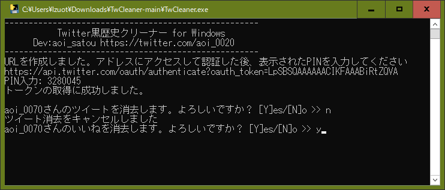

# TwCleaner
今までのツイートやいいねの履歴を簡単に消去することができます。

TwitterAPI有料化に伴い公式APIを使用して動作するようにしました。(半分アウトかもしれないけどw) 

# 実行する前に

Windowsを使用してる方は、EXEをダウンロードするとウイルス判定されることがあります。(無署名だからかも)  
Windows Defenderを一時的に無効にしてから実行してください。  
このソフトを実行したことによる故障や損害について開発者は責任を負いかねます

# 実行の仕方

バイナリをダブルクリックするとブラウザが開き、Twitterのログインページが表示されます。  
アプリを連携させて、表示されたPINコードをプロンプトに入力します。  
確認画面でユーザーIDを確認し、[Y]を入力します。  
ツイート削除が完了するといいねの取り消しを聞かれます。  
すべてのツイートが消去・いいね取り消しができてない場合は、しばらく待ってから再試行してください。

